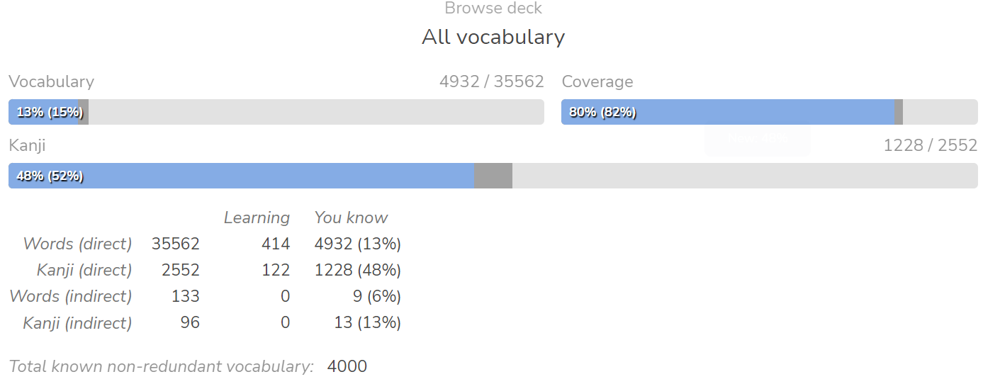
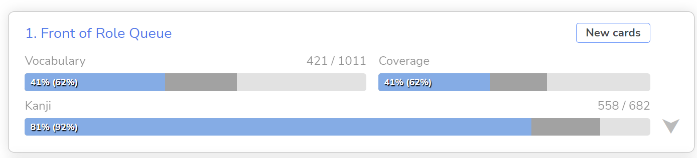
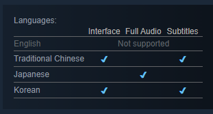

# Day 165 - 2/2/23 - 4000 Words Known

Day 165

- Hit 4k words known finally. +1k words over 57 days
- 16/217 n3 bunpro (I hate doing this, haven't made much progress because of that lol)

Having a dedicated deck for FORQ worked out pretty well. It lets me make adhoc adjustments and inspect it as well, compared to using the built-in feature:

It's been a while since the last update. For most of December I was trying out game dev with Rust and Bevy. Game Dev's fun, but it takes a ton of time and you make pretty slow progress.
I was a bit burnt out of learning Japanese, and it turns out I don't have enough time to do both game dev and study Japanese, and so most of December was lost to gamedev time.

In January I started playing Trails to Azure (碧の軌跡). It renewed my interest for learning Japanese (and gaming in general), and now I don't have time for gamedev. Well that's life I guess.
Masterpiece of a game btw, would recommend to any JRPG fan.

Starting Trails of Cold Steel III (閃の軌跡Ⅲ) now (played CS1 and 2 a while ago, but went back and played through the older games to catch up to the story).
It's certainly quite a bit jarring going back to 3d games compared to Azure.

One pretty big motivator for me to learn Japanese was to able to play Japanese games early without being translated, but a thing that I just learned is that the Chinese pc port of Kuro no Kiseki (黎の軌跡) doesn't have JP text, so I have to wait for the NA version anyway:

(Seriously, what the hell is this combination of languages)

Guess I shoulda learned Korean or Chinese instead

## Japanese Ability

At least for Flying Witch, the difference between 3k and 4k words has felt a lot better than 2k-3k. Can sometimes read an entire chapter without having to look up words, unless there's a certain samurai guy talking.

Katakana reading has gotten a lot speedier due to all the Katakana in videogames. It still roadblocks me but not as much

Watched a random youtube videos with n3 practice questions, and I got most of them right, so maybe I'm at n3 level now. Who knows.

## Media Consumption

Games
- Trails to Azure - 碧の軌跡 - (In English, JP voices) - It's a 80+ hr game in english already, cut me some slack
- Trails of Cold Steel 3 - 閃の軌跡Ⅲ - (English, JP voices) - In Progress
- Marco and the Galaxy Dragon - マルコと銀河竜 - In Progress

Manga
- Flying Witch - ふらいんぐうぃっち - up to chapter 56
- Sousou no Frieren - 葬送のフリーレン - couple chapters

Anime
- Bocchi The Rock - In Progress
- Wotakoi - In Progress