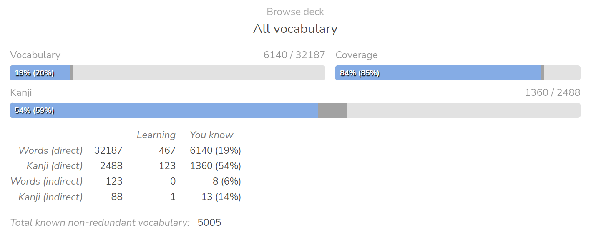
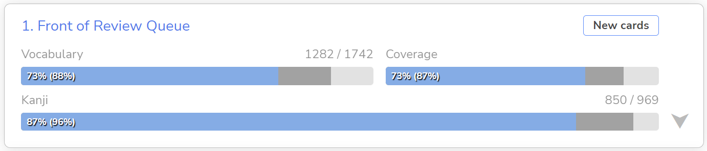
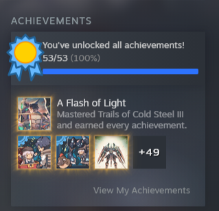

# Day 212 - 3/20/23 - 5000 Words Known

Day 212

- Hit 5k words. +1k words over 47 days
- 37/217 n3 bunpro. I'll probably just speedrun this but not review. It's too much of a pain doing the SRS

FORQ Status:

With the new JPDB API, it's a lot less painless to add all the obvious counting words like 一階 or something. On the other hand my FORQ keeps increasing more than my quota and I'm not sure how to manage that.

Not really sure what to write here. Played a lot of videogames, guess I'll talk about those:

### Trails of Cold Steel 3

100%ed Trails of Cold Steel 3, Total Playtime: 171 hours apparently. Includes AFK time though

TL;DR, the story was okay, the gameplay was too easy until I downloaded a difficulty mod, and then it was fun. I'm a person who enjoys spending hours on bossfights. Probably doubled my playtime though.
More details/ramblings here: ![[Trails Series (軌跡)]]

Random highlights:

Can I get a turn please (bossfight spoiler):
https://youtu.be/UjJX1wfS-1Q

Under the ground bug:
https://youtu.be/oAWMrGHueAU

### Genshin Impact

Got back into this game after a 2 year hiatus. Mostly just taking it casually and playing through the story, which is basically a walking simulator / VN.

### Affogato (Demo ver.)

Played this on a whim from an ad. Decently well made, reverse tower defense game + coffee shop simulator (if that doesn't make sense, just look it up). China dev's, but has JP language support.
Features nice jazzy music: ![[Her majesty Loop.wav]]

### Persona 5 Royal

Game oozes style. I've watched a playthrough the original a while ago in English, but not Royal. Haven't got far into it yet, but it feels a lot better to play than to watch

### VN's, Manga, Anime

Still trudging along with these, though I don't really have the time to spare to play/watch them much so I don't make much progress lol

## Japanese Ability

At this point, I feel like I'm more fustrated at what I don't know than being excited about what I do know. I'm now a jaded Japanese learner old man.

## Media Consumption - Progress - Perceived JP Difficulty

Games
- Trails of Cold Steel 3 - 閃の軌跡Ⅲ - (English, JP voices) - Finished - Hard due to a lot of Vocab or just fantasy talking styles 
- Trails of Cold Steel 4 - 閃の軌跡IV - (English, JP voices) - In Progress
- Marco and the Galaxy Dragon - マルコと銀河竜 - In Progress - Easy, Recommended
- Persona 5 Royal - In Progress - Decent
- Genshin Impact - In Progress - Hard, so many fake lore words

Manga
- Flying Witch - ふらいんぐうぃっち - up to chapter 65 - Easy, Recommended
- Sousou no Frieren - 葬送のフリーレン - couple chapters - Harder-ish Intro, easy after that

Anime
- Bocchi The Rock - In Progress - Easy but harder with JP subtitles for some reason for me
- Wotakoi - In Progress - Easy but sometimes hard due to Otaku references