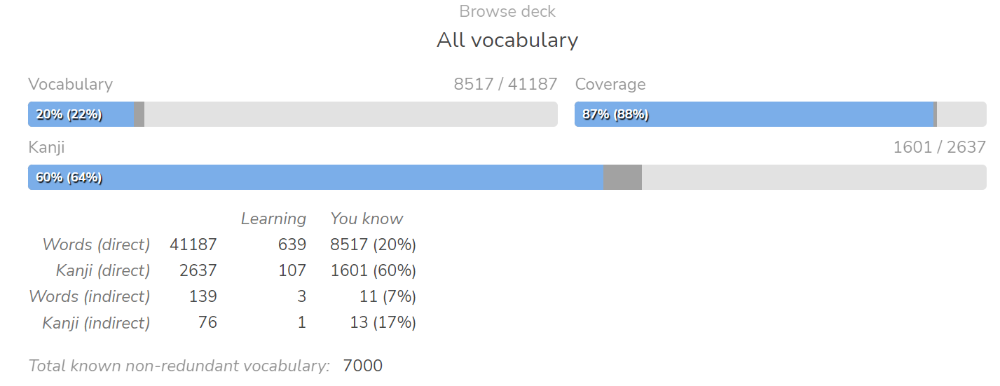

# Day 291 - 6/08/23 - 7000 Words Known

Day 291

- Hit 7k words. +2k words over 79 days
- 67/217 n3 bunpro. Don't really do this anymore

Went to Hawaii, played some games. Idk, lazy to really write a proper blog

### VN's, Manga, Anime

Flying Witch - 8 chapters - good manga. About a witch who's just living in Japan, except it's more slice of life, less magic. Easy, always a new environment each chapter so a nice balance of new words as you read through. Recommended if you like slice of life

Sousou no Frieren - 33 chapters - really good manga. About an elf who outlives her companions, and travels the world again in their memory. Somber/reminiscing tone, Nice balance between action, and slife of life / life lesson. 

また同じ夢を見ていた - 161/300 pages - I like this book so far, but it did take quite a while for the story to start moving I feel

Bocchi The Rock - 2 episodes

Honkai Star Rail - Beat 1.0 Story - ??? Hours

Marco and the Galaxy Dragon - couple hours

Playing Trails of Cold Steel 4 In English so it doesn't really count

I should watch more anime, my listening skills are lacking

## Media Consumption - Progress - Perceived JP Difficulty

Games
- Trails of Cold Steel 4 - 閃の軌跡IV - (English, JP voices) - In Progress, Almost done, unfortunately the difficulty mod is incompatible with JP text
- Marco and the Galaxy Dragon - マルコと銀河竜 - In Progress - Easy, Recommended
- Persona 5 Royal - Didn't really play yet, trying to finish some other games
- Genshin Impact - Quit
- Honkai Star Rail - Played through the story - Hard, a lot of fake words
- Breath of the Wild 2 - Barely started - Easy enough

Manga
- Flying Witch - ふらいんぐうぃっち - Finished - Easy, Recommended
- Sousou no Frieren - 葬送のフリーレン - 33 chapters - Harder-ish Intro, easy after that

Anime
- Bocchi The Rock - 11/12 episodes - I'll finish this eventually I promise

Novels
- また同じ夢を見ていた - 161/300 pages - Easy but metaphoric and therefore I feel like I don't know what's happening sometimes